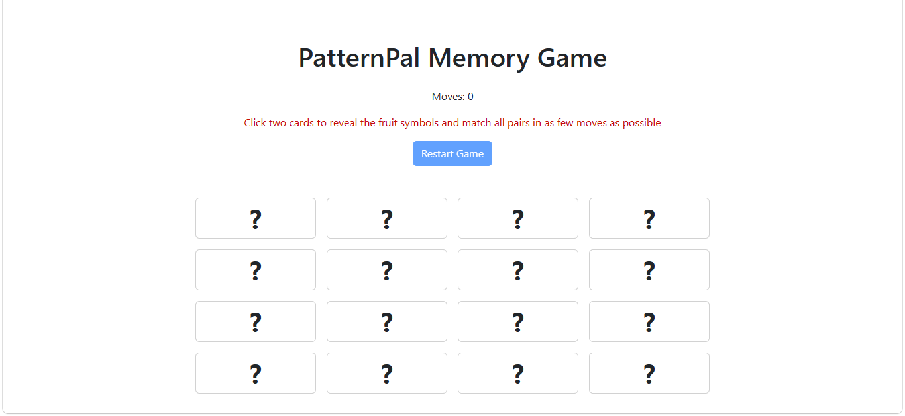
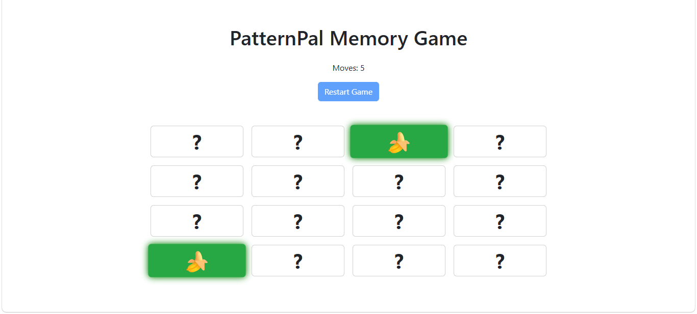
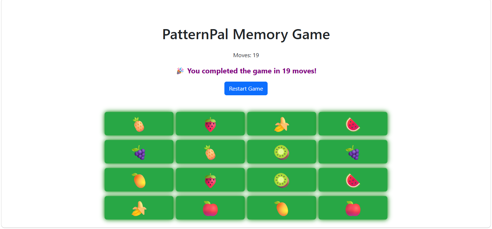
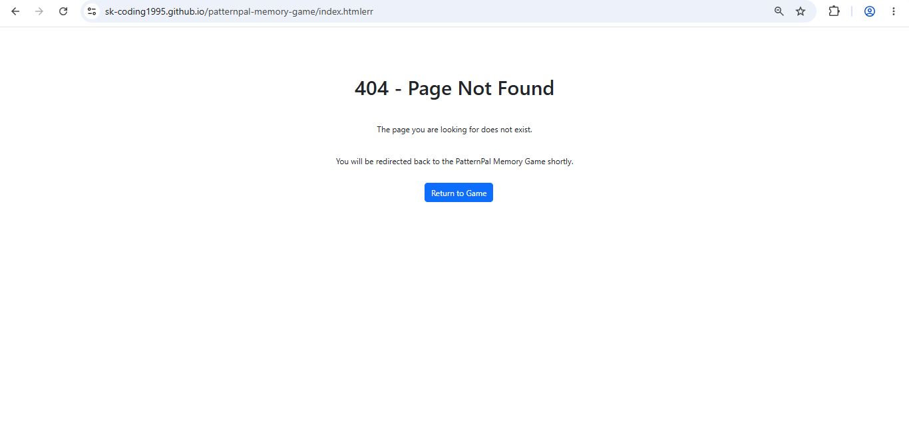

# PatternPal Memory Game (Interactive Front-end Web Application)

## Project overview
PatternPal Memory Game is an interactive front-end web application built using HTML, CSS and JavaScript. The project is a simple browser-based memory game where the user flips cards, remembers their positions and matches all pairs.

The aim of this project is to create a game that feels clear, engaging and easy to use, while also demonstrating front-end interactivity, user feedback and game logic using custom JavaScript.

## Project rationale
The idea behind this project was to create a simple interactive memory game that focuses on concentration, pattern recognition and user interaction. Some online games can feel too distracting or overcomplicated, especially for users who just want something quick and easy to play. For this reason, I chose to build a smaller single-page game that keeps the interface clear and straightforward.

The project is aimed at users who want a simple game that is easy to understand and works well on both desktop and smaller screens. The design decisions were based around simplicity, readability and ease of interaction. The overall goal was to keep the layout clean, make the controls obvious and ensure the game gives clear feedback to the user throughout play.

## Purpose and value
The purpose of this project is to provide a simple and enjoyable memory game that allows users to test their concentration and matching skills.

The project provides value by giving users an interactive activity that is easy to start, easy to understand and visually clear. Rather than adding unnecessary complexity, the game focuses on a single objective which is matching all card pairs in as few moves as possible.

The goal is to provide a practical interactive application that demonstrates front-end development skills while also offering a clear and enjoyable user experience.

## Target audience
The target audience consists of:
- Users who enjoy simple puzzle or memory-based games
- Users who want a quick and easy game that does not feel confusing
- Desktop and mobile users who need a clear and readable layout
- Beginner users who should be able to understand the game without instructions

## User stories
- As a user, I want to click cards and reveal hidden values so I can try to find matching pairs
- As a user, I want the game to count my moves so I can track my progress
- As a user, I want clear feedback when I complete the game so I know I have finished successfully
- As a user, I want a restart option so I can quickly play again
- As a user, I want the game to remain clear and easy to use on different screen sizes

## Website pages
The project currently consists of:
- `index.html` - main game page containing the interactive memory game
- `404.html` - custom error page that redirects the user back to the main game

## Accessibility
- Uses semantic HTML elements such as `header`, `main`, `section` and `button`
- Clear heading structure to identify the purpose of the page
- Large clickable cards to make interaction easier
- Restart button is clearly labelled and positioned near the top of the page
- Text remains legible against the background
- Simple single-page layout helps users navigate the game without confusion
- A custom `404.html` page redirects the user back to the main game without relying on browser navigation

## Screenshots linked to user stories

### User story 1: matching hidden pairs
The main game page allows the user to click cards and reveal hidden values in order to find matching pairs.

### User story 2: tracking progress
The move counter gives the user feedback while playing so they can see how many moves they have used.

### User story 3: completing the game
When all pairs are matched, the game displays a clear completion message and allows the user to restart.

### User story 4: handling missing pages
The custom 404 page provides a clear message and returns the user to the game.

## Technologies used
- HTML5
- CSS3
- JavaScript
- Bootstrap 5
- Visual Studio Code
- GitHub (for version control)
- GitHub Pages for deployment
- Microsoft Word (used to create the wireframe sketch)

The wireframe was sketched in Microsoft Word to plan the layout of the desktop game screen, mobile version and custom 404 page.