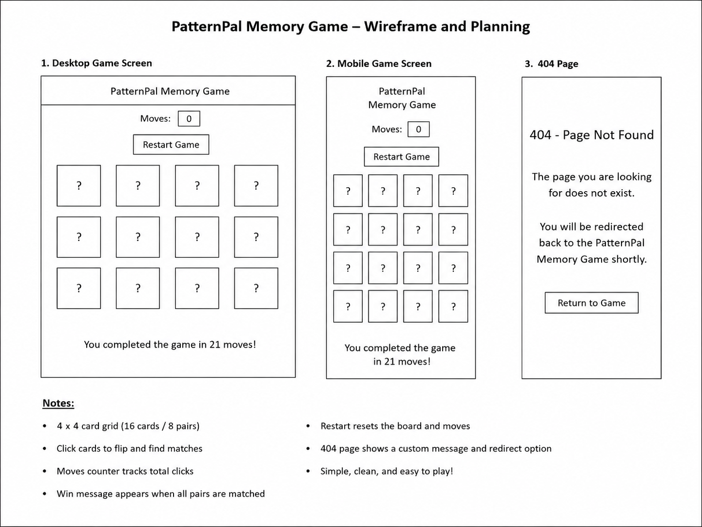

# PatternPal Memory Game (Interactive Front-end Web Application)

## Project overview
PatternPal Memory Game is an interactive front-end web application built using HTML, CSS and JavaScript. The project is a simple browser-based memory game where the user flips cards, remembers their positions and matches all pairs.

The aim of this project is to create a game that feels clear, engaging and easy to use, while also demonstrating front-end interactivity, user feedback and game logic using custom JavaScript.

## Project rationale
The idea behind this project was to create a simple interactive memory game that focuses on concentration, pattern recognition and user interaction. Some online games can feel too distracting or overcomplicated, especially for users who just want something quick and easy to play. For this reason, I chose to build a smaller single-page game that keeps the interface clear and straightforward.

The project is aimed at users who want a simple game that is easy to understand and works well on both desktop and smaller screens. The design decisions were based around simplicity, readability and ease of interaction. The overall goal was to keep the layout clean, make the controls obvious and ensure the game gives clear feedback to the user throughout play.

## Purpose and value
The purpose of this project is to provide a simple and enjoyable memory game that allows users to test their concentration and matching skills.

The project provides value by giving users an interactive activity that is easy to start, easy to understand and visually clear. Rather than adding unnecessary complexity, the game focuses on a single objective which is matching all card pairs in as few moves as possible.

The goal is to provide a practical interactive application that demonstrates front-end development skills while also offering a clear and enjoyable user experience.

## Target audience
The target audience consists of:
- Users who enjoy simple puzzle or memory-based games
- Users who want a quick and easy game that does not feel confusing
- Desktop and mobile users who need a clear and readable layout
- Beginner users who should be able to understand the game without instructions

## User stories
- As a user, I want to click cards and reveal hidden values so I can try to find matching pairs
- As a user, I want the game to count my moves so I can track my progress
- As a user, I want clear feedback when I complete the game so I know I have finished successfully
- As a user, I want a restart option so I can quickly play again
- As a user, I want the game to remain clear and easy to use on different screen sizes

## Website pages
The project currently consists of:
- `index.html` - main game page containing the interactive memory game
- `404.html` - custom error page that redirects the user back to the main game

## Accessibility
- Uses semantic HTML elements such as `header`, `main`, `section` and `button`
- Clear heading structure to identify the purpose of the page
- Large clickable cards to make interaction easier
- Restart button is clearly labelled and positioned near the top of the page
- Text remains legible against the background
- Simple single-page layout helps users navigate the game without confusion
- A custom `404.html` page redirects the user back to the main game without relying on browser navigation

## Screenshots linked to user stories

### User story 1: matching hidden pairs
The main game page allows the user to click cards and reveal hidden values in order to find matching pairs.

### User story 2: tracking progress
The move counter gives the user feedback while playing so they can see how many moves they have used.

### User story 3: completing the game
When all pairs are matched, the game displays a clear completion message and allows the user to restart.

### User story 4: handling missing pages
The custom 404 page provides a clear message and returns the user to the game.

 

## Wireframe sketch and UX planning
The wireframe was sketched in Microsoft Word to plan the layout of the desktop game screen, mobile version and custom 404 page before the final implementation was completed.

The sketch helped define the main structure of the project, including:
- the position of the game title
- the move counter and restart button
- the centred 4 x 4 game grid
- the win feedback area
- the layout of the custom 404 page

The final implementation followed this planned structure closely, while small adjustments were made during development to improve usability and clarity.

## Technologies used
- HTML5
- CSS3
- JavaScript
- Bootstrap 5
- Visual Studio Code
- GitHub (for version control)
- GitHub Pages for deployment
- Microsoft Word (used to create the wireframe sketch)

## Development lifecycle

### Planning
The project began with the idea of creating a simple interactive memory game that would be easy to understand and enjoyable to use. The main aim was to build a front-end application that focused on concentration, pattern recognition and user interaction without becoming too complex. Early planning identified the main layout of the page, the target audience and the key features needed for the game, including a move counter, card matching logic, restart control and end-game feedback.

The project was planned as a single-page interactive game so that users could focus on playing without needing to navigate between different sections. A custom 404 page was also included later in development to improve the overall user experience and meet the project requirements more fully.

### Structure
The HTML structure was kept simple so the page would be easy to follow and accessible to different users. The heading, move counter, instruction text, restart button and game board were positioned in a clear order so the user could quickly understand the purpose of the page and how to interact with it.

The game board was built dynamically using JavaScript rather than hardcoding each card into the HTML. This made the project easier to manage and allowed the card values to be shuffled and reset more efficiently during gameplay. A custom `404.html` page was also added to support navigation back to the main page if a missing page was accessed.

### Styling
CSS was added to give the game a consistent and readable appearance. The cards were styled with hover effects, matched-card feedback and visual changes when selected. The aim was to make the game look interactive without overcomplicating the design.

Bootstrap was used to help manage layout structure and spacing, while custom CSS was used to control the specific visual style of the game. During development, small refinements were made to improve the appearance of the title, cards, win message and overall readability. The final styling remained simple so the game stayed clear and easy to use.

### Interactivity
JavaScript was used to create the main game functionality, including shuffling the cards, revealing values, checking for matches, counting moves, resetting the game and displaying a completion message when all pairs had been matched.

The interactive logic was developed step by step and improved over time. Conditions were added to prevent invalid interactions such as selecting the same card twice, clicking matched cards again or clicking during a locked board state. A restart button was also implemented so the user could start a new game after completion, and the win feedback was refined so the end of the game felt clearer and more user friendly.

### Testing and improvement
Testing took place throughout the development process rather than only at the end. Core features such as card interaction, match checking, move counting, reset behaviour and win detection were tested manually as they were added. Additional testing was later used to check edge cases such as repeated clicks, rapid clicking and invalid interaction with matched cards.

As bugs were found, they were recorded and corrected in later commits. This helped improve the overall reliability of the game and ensured that the interface and logic became more stable over time. Testing was also used to confirm that the 404 page redirected correctly and that the deployed version of the project matched the development version.

## Reflection on the development process
During development, the main focus of the project was to keep the game simple, clear and interactive while still meeting the requirements of the assessment. One of the main challenges was balancing visual design with stable functionality. For example, a more advanced flip-card effect was explored during development, but it introduced layout problems and made the game less reliable. Because of this, a simpler and more stable version was kept, which better suited the project and the intended user experience.

Another important area of improvement was interaction control. Several checks had to be added to make sure the game handled user input properly, especially when cards were clicked repeatedly or too quickly. These refinements made the game more reliable and improved the flow of play.

The project stayed close to the original planned structure, but it also changed in small ways during development as testing identified opportunities to improve clarity and usability. The final result is a simple but effective interactive memory game that meets its purpose, provides clear feedback to the user and demonstrates the use of structured HTML, custom styling and JavaScript logic in a front-end web application.

## Validation

### Validation evidence
The code was checked during development to ensure the structure and styling remained as clean and error free as possible. HTML was validated using the W3C Markup Validation Service and CSS was validated using the W3C CSS Validation Service. JavaScript was also reviewed to ensure there were no major errors affecting the game during user interaction.

### HTML validation
The main HTML pages used in the project were checked for structural issues and corrected where needed.

- `index.html` – checked and corrected during development
- `404.html` – checked after the custom page and redirect were added

### CSS validation
The stylesheet used for the project was reviewed and adjusted during development to ensure that the final styling remained consistent and valid.

- `styles.css` – checked and corrected during development

## Testing
A full manual testing record for the project is included in the `testing.md` file. This includes:
- core gameplay testing
- edge case testing
- bugs found during development
- fixes applied to improve reliability and usability

Testing was carried out throughout the development process rather than only at the end. This made it possible to identify problems early, improve interaction logic, and refine the final user experience.

The deployed version of the project was also checked to ensure it matched the development version and that the custom `404.html` page worked correctly on GitHub Pages.

## Deployment procedure
The project was deployed using GitHub Pages so the final version of the game could be accessed online.

### Steps to deploy
1. Open the project repository on GitHub.
2. Go to **Settings**.
3. Select **Pages** from the side menu.
4. Under the source settings, choose the correct branch for deployment.
5. Select the root folder if required.
6. Save the settings.
7. Wait for GitHub Pages to finish building the site.
8. Open the live project link once deployment is complete.
9. Carry out a final check to ensure the deployed version matches the local development version.

### Deployed project checks
After deployment, the live version of the project was tested to confirm that:
- the main game page loaded correctly
- card interaction still worked as expected
- the move counter updated correctly
- the restart button worked after completing the game
- the custom `404.html` page redirected the user back to the main game

## Credits and attribution

### Third-party content used in the project
The following external resources were used directly in the project:
- Bootstrap 5 CDN for layout, spacing and button styling
- Microsoft Word to create the wireframe sketch used during planning

### Custom code and project work
All HTML structure, CSS styling, JavaScript game logic, project content, layout decisions and documentation for this project were created by me.

### Reference sources used during development
The following resources were used for learning, reference and checking good practice during development:
- Codeinstitute
- FreeCodeCamp
- Codecademy
- MDN Web Docs
- W3C Markup Validation Service
- W3C CSS Validation Service
- JSlint
- YouTube